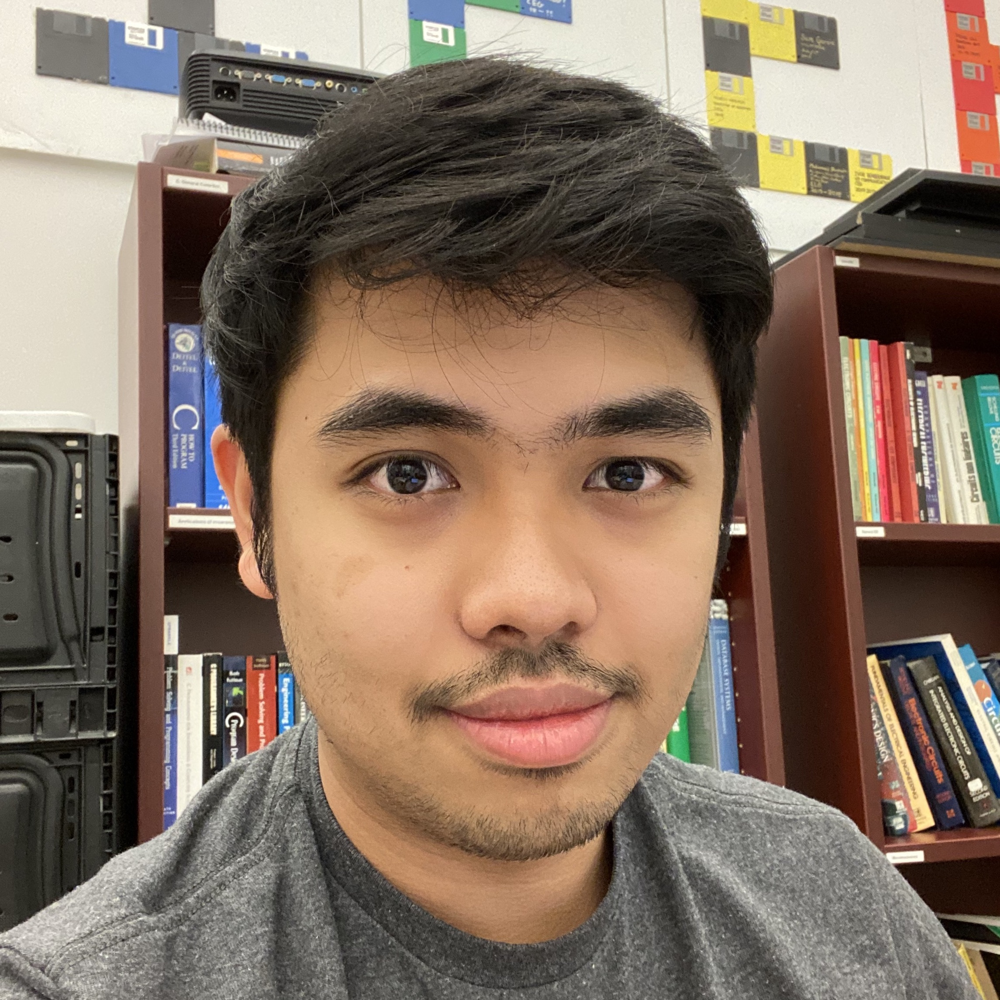
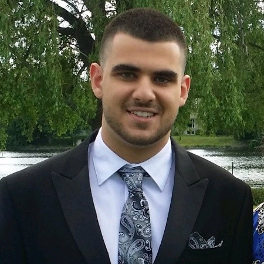

<table align="center"><tr><td align="center" width="9999">

# Computer Engineering Capstone Project
# Smart Search and Rescue Drone

CEG 4912 & CEG 4913 Final Year Project at University of Ottawa 
</td></tr></table>

&nbsp;
&nbsp;
&nbsp;

# System Architecture 

  

# Group Members

<table>
  <tr>
    <td align="center">
      <a href="https://www.idarkduck.com/">
         
        
          <b> Nevin WS Ganesan</b>
        
      </a>
       
    </td>
    <td align="center">
      <a href="https://pfarah65.github.io/portfolio/">
         
        
          <b> Peter Farah </b>
        
      </a>
       
    </td>
     <td align="center">
      <a href="http://divyang.ca/">
         
        
          <b> Divyang Arora</b>
        
      </a>
       
    </td>
     <td align="center">
      <a href="https://www.linkedin.com/in/paul-andr%C3%A9-abou-zeid/">
         
        
          <b> Paul-André Abouzeid </b>
        
      </a>
       
    </td>
     <td align="center">
      <a href="https://www.linkedin.com/in/shail-patel-4a9b3a14a/">
         
        
          <b> Shail Patel </b>
        
      </a>
       
    </td>
  </tr>
</table>

